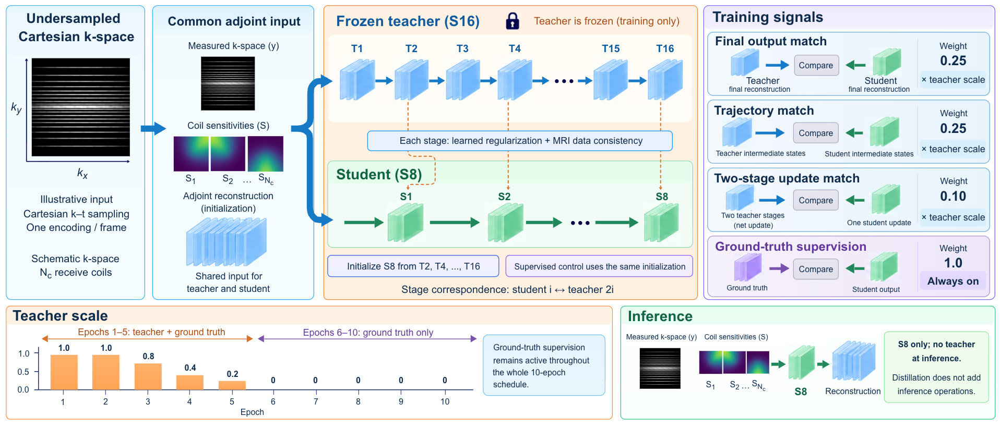

# Stage-Aligned Knowledge Distillation for Fast and Memory-Efficient 4D Flow MRI Reconstruction

[](pyproject.toml)
[](pyproject.toml)
[](LICENSE-CODE.txt)
[](LICENSE-DATA.md)


**Yuliang Xiao, Kian Anvari Hamedani, Zach Vavasour, Simon J. Graham, and Mark Chiew**

CMRx4DFlow 2026 · MICCAI workshop

[Overview](#method-overview) · [Reproduction](docs/reproduction.md) · [Data](docs/data.md) · [Checkpoints](docs/checkpoints.md) · [Citation](#citation)

This code trains an eight-stage FlowVN student from a frozen sixteen-stage
teacher. Student stages align with pairs of teacher stages, using supervision
on the final reconstruction, intermediate reconstructions, and stage updates.
The teacher is used during training only.

## Method overview

[](assets/method-overview.png)

*S16-to-S8 distillation. The distilled student and matched
supervised control both copy teacher stages 2, 4, ..., 16 for initialization.
Input tiles are schematic illustrations. Click the figure to enlarge it.*

The implementation uses Cartesian k–t Gaussian masks. Both networks also
use measured k-space and coil sensitivities for data consistency. The four
training recipes below separate teacher initialization from the contribution
of each distillation loss.

This repository contains code, citation metadata, and the method overview.
The accepted manuscript, challenge data, and trained weights are not included.

## Installation

Clone the repository and install
[uv](https://docs.astral.sh/uv/getting-started/installation/):

```bash
git clone https://github.com/YuliangXiaoYLX/flowvn-distillation.git
cd flowvn-distillation
```

For Linux CUDA training, select the Python version used for the paper:

```bash
export UV_PYTHON=3.10.20
uv sync --locked --extra cuda
```

For development on an Apple Silicon Mac, use `uv sync --locked --extra cpu`
with the default Python 3.12.13. The Mac lock uses a newer SciPy wheel because
the historical wheel fails to import on macOS 27. Linux CPU development also
uses `uv sync --locked --extra cpu`; keep `--extra cpu` on subsequent `uv run`
commands so uv retains the CPU build.

Linux training and full-volume reconstruction require an NVIDIA GPU. On Linux,
the `cuda` extra selects the CUDA 13.0 PyTorch build. Weights & Biases is optional:
`uv sync --locked --extra cuda --extra wandb` for GPU training, then enable
`use_wandb` in your config.
Keep `--extra wandb` on the corresponding `uv run` commands as well.
Logging is local by default.

## Try the model without data

```bash
uv run --locked --extra cpu python scripts/benchmark_flowvn.py \
  --device cpu --num-stages 2 --features-out 2 --kernel-size 3 \
  --depth 3 --time-frames 3 --spatial-size 8 --coils 2 \
  --num-warmup 1 --num-iters 2

uv run --locked --extra cpu python -m unittest discover -s tests
```

This uses random complex tensors and random weights. It checks that the model
runs; its timing and outputs are not paper results.

## Reconstruct

Prepare the files described in [Data](docs/data.md), place an authorized S8
checkpoint in `checkpoints/`, and update paths in `configs/inference.yaml`.

```bash
uv run --locked --extra cuda python main.py --config configs/inference.yaml \
  --ckpt_path checkpoints/s8_full_seed12345.ckpt
```

Reconstructed complex arrays are written under `outputs/reconstructions/`.
The checkpoint must match `num_stages`; set it to `16` for an S16 model.

## Train

All recipes use the same S16 initialization, ten-epoch budget, and data splits.

| Config | Final-output loss | Trajectory loss | Update loss |
| --- | ---: | ---: | ---: |
| `configs/s8_supervised.yaml` | 0 | 0 | 0 |
| `configs/s8_final.yaml` | 0.25 | 0 | 0 |
| `configs/s8_trajectory.yaml` | 0.25 | 0.25 | 0 |
| `configs/s8_full.yaml` | 0.25 | 0.25 | 0.10 |

Obtain the authorized data, S16 teacher, and organizer mask package, then edit
the relative paths in the config. Use the organizer masks for the paper recipes:

```bash
export FLOWVN_MASK_BACKEND=challenge
export FLOWVN_CHALLENGE_MASK_ARCHIVE="$PWD/external/CMRx4DFlowMaskGeneration.zip"

uv run --locked --extra cuda python main.py --config configs/s8_full.yaml \
  --seed 12345 --save_dir outputs/s8_full/seed12345
```

Repeat each recipe with seeds `12345` and `23456`, using a separate output
directory. The ground-truth loss stays active throughout training; the teacher
losses are scheduled off after epoch five. Full-state checkpoints support
resuming interrupted training. See [Reproduction](docs/reproduction.md) for
evaluation, checkpoint selection, statistics, and the two benchmark protocols.

## Code map

```text
main.py                         Training, validation, and reconstruction
networks/flowvn.py               Unrolled reconstruction model
utils/flowvn_distillation.py     Stage alignment and teacher losses
utils/dataloader_CMRx4DFlow.py   Data loading and preprocessing
utils/flowvn_validation.py       Grouped validation across velocity encodings
utils/utils_metrics.py           Image, phase, and physical velocity metrics
configs/                        Four training recipes, validation, inference
scripts/                        Timing and case-level analysis
tests/                          Synthetic behavior and command checks
```

## Citation

```bibtex
@inproceedings{xiao2026stagealigned,
  title = {Stage-Aligned Knowledge Distillation for Fast and Memory-Efficient 4D Flow MRI Reconstruction},
  author = {Xiao, Yuliang and Anvari Hamedani, Kian and Vavasour, Zach and Graham, Simon J. and Chiew, Mark},
  booktitle = {MICCAI CMRx4DFlow 2026 Workshop},
  year = {2026},
  url = {https://openreview.net/forum?id=ZmT3bhaD1w}
}
```

Proceedings metadata will be added when available. Machine-readable citation:
[CITATION.cff](CITATION.cff).

## Acknowledgments and licenses

This project builds on FlowVN, the organizer's reconstruction demo, and the
implementations credited in [THIRD_PARTY_NOTICES.md](THIRD_PARTY_NOTICES.md).
The project's own code is provided under the [MIT license](LICENSE).
Third-party components retain their upstream terms, including the noncommercial
terms stated for PCMRI-MSAC. See [THIRD_PARTY_NOTICES.md](THIRD_PARTY_NOTICES.md)
for file-level attribution and license scope.
